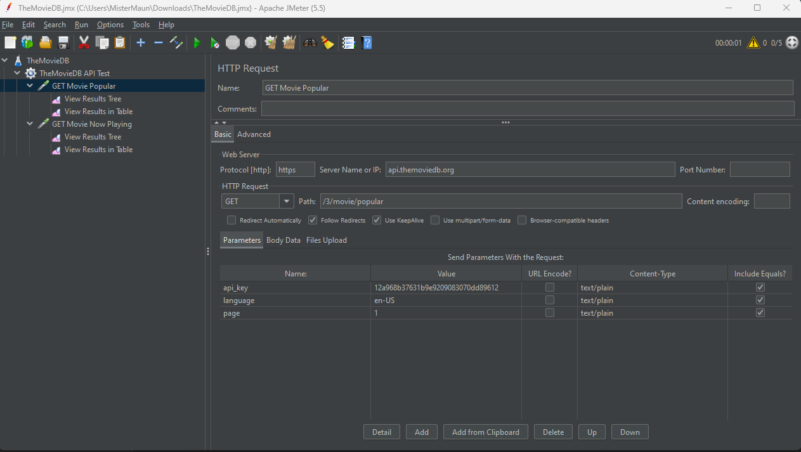
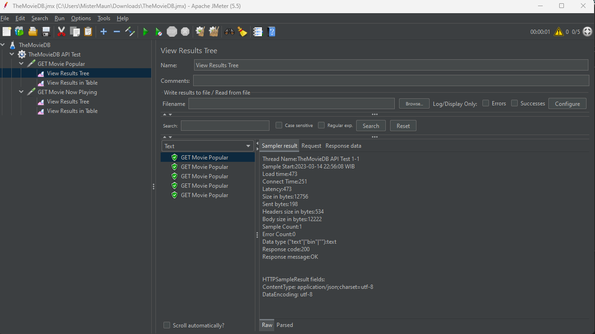
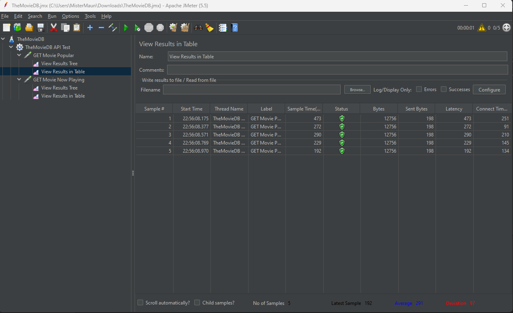
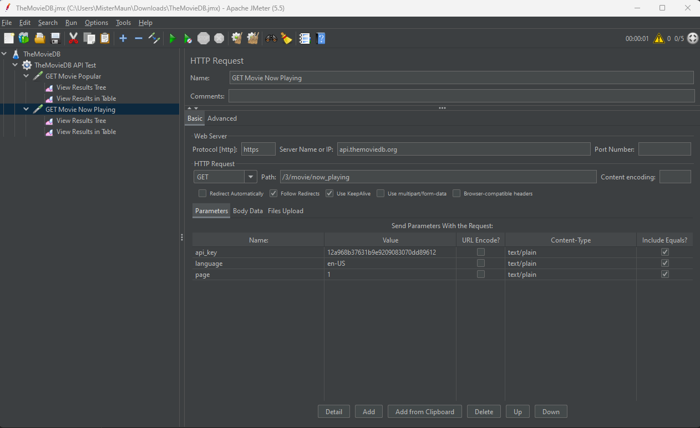
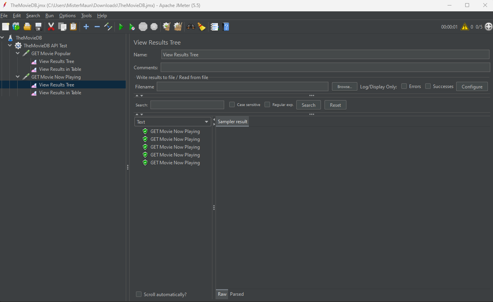
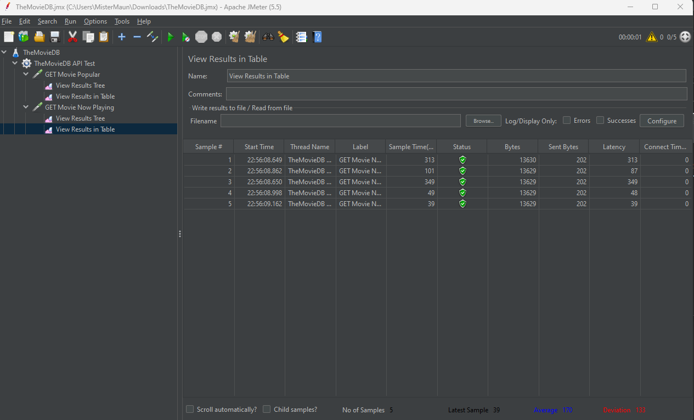

# Post Test Day 27
## Important Notes
***
>This *tiny* project is created in order to accomplish assignment on JuaraCoding SQA Automation Bootcamp Day 27.
> 
> This repository just containing .jmx files and screenshot necesarry to fulfill my assignments
> 
>This project is containing:
> 1. [GET Movie Popular HTTP Request](https://developers.themoviedb.org/3/movies/get-popular-movies)
> 2. [GET Now Playing HTTP Request](https://developers.themoviedb.org/3/movies/get-now-playing)
>
> All HTTP Request is tested using [Apache JMeter](https://jmeter.apache.org/download_jmeter.cgi)

## 1. Get Movie Popular HTTP Request
***

Screenshot above showing preparation needed before running the test. api_key parameter is used to store our TheMovieDB API Key.
After running the test, you can see the result from two listeners below.

    <table>
	    <tr>
    	    <td style="padding:10px">
        	    
                 
                View Results Tree
      	    </td>
            <td style="padding:10px">
            	
                 
                View Results as Table
            </td>
        </tr>
    </table>

## 2. Get Movie Play Now HTTP Request
***
Just like the above, this time is for Play Now using API Key from TheMovieDB

Below is screenshots from listeners used in the testing:

    <table>
	    <tr>
    	    <td style="padding:10px">
        	    
                 
                View Results Tree
      	    </td>
            <td style="padding:10px">
            	
                 
                View Results as Table
            </td>
        </tr>
    </table>

